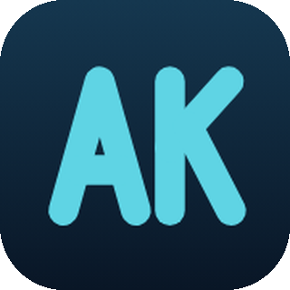
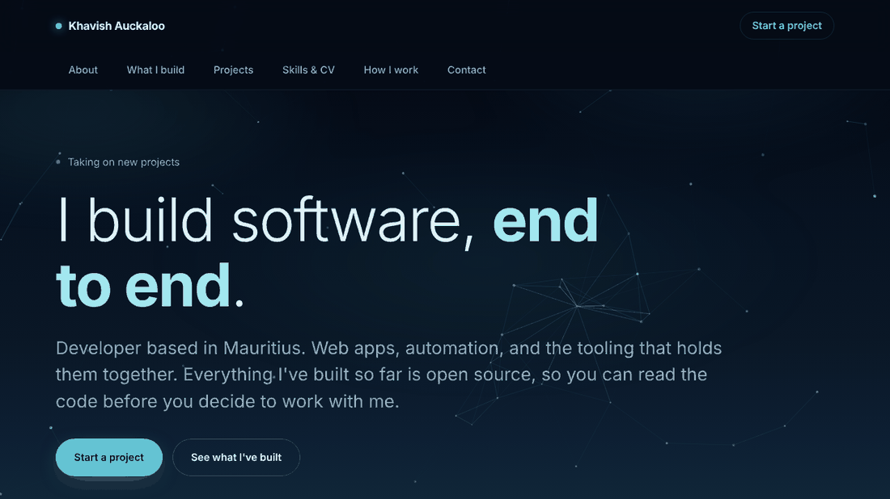

  

<h1 align="center">Khavish Auckaloo</h1>

  <strong>My portfolio.</strong> 
  One HTML file, no build step, nothing to install.

  
  
  
  

  

---

## The projects list

Pulls from the GitHub API on load and shows any public repo tagged `portfolio`, newest
push first. So adding a project is a topic on GitHub, not an edit in here.

The entries in the markup are the fallback. They show up with JS off, or if the API is
down, or once you've hit the rate limit. Search engines index those rather than the
fetched ones, so keep them roughly right.

## Working on it

Open `index.html` in a browser. There's nothing to install.

Colours, type scale and spacing are custom properties in the `:root` block at the top of
the stylesheet. Change one, it updates everywhere.

Push to `main` and it's live.

## Notes

Laid out for anything from a 280px phone up to a 2560px monitor. Header height is
measured at runtime rather than hardcoded, because a wrapped brand was pushing the tab
bar underneath it at 320px.

The background is a canvas particle field that reacts to the cursor. Count scales with
the viewport so phones run fewer of them. Pauses when the tab is hidden, and turns
itself off under `prefers-reduced-motion`.
